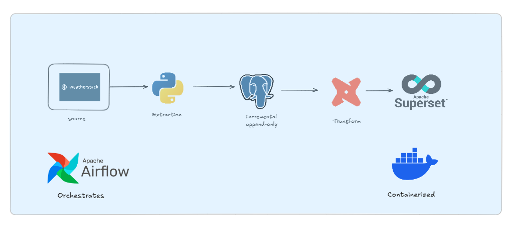

# Weather data pipeline

This is a small end-to-end data platform for collecting and exploring weather
data. It asks Weatherstack for the current conditions in New York, stores each
response in PostgreSQL, transforms the data with dbt, and exposes the results
through Superset dashboards. Airflow keeps the whole process running on a
daily schedule.

The raw table is append-only: every successful run adds a new observation.
The dbt models then rebuild the reporting tables from the available raw data,
including a deduplication step based on the weather timestamp.

## How the pipeline fits together



## Prerequisites

- Docker Desktop with Docker Compose
- A Weatherstack API key
- Git

## Local setup

1. Copy `.env.example` to `.env` and set `API_KEY`.
2. Set `DBT_PROJECT_HOST_PATH` and `DBT_PROFILES_HOST_PATH` to the absolute
   paths of this checkout on the Docker host.
3. Copy `docker/.env.example` to `docker/.env`.
4. Replace every `replace_with_...` value in `docker/.env` and
   `superset_init.sql` with your local values. Keep the corresponding
   Superset database passwords consistent between the files.
5. Start the stack:

   ```bash
   docker compose up
   ```

Airflow is available at `http://localhost:8000` and Superset at
`http://localhost:8088`. PostgreSQL and Redis are also published for local
development. Do not expose those ports directly to the internet without
adding authentication and network controls.

On the first run, PostgreSQL initializes its databases, Airflow starts the DAG,
and the pipeline creates the raw weather table. Each successful DAG run then
follows this sequence:

1. Fetch the current weather from Weatherstack.
2. Append the response to PostgreSQL.
3. Run `dbt build` to rebuild the staging and reporting tables.
4. Make the latest transformed data available to Superset.

The API key is read only from the environment; it is intentionally not stored
in this repository.

## Project layout

- `airflow/dags/`: Airflow orchestration
- `api-request/`: Weatherstack extraction and PostgreSQL loading
- `dbt/dbt/my_project/`: dbt models and tests
- `docker/`: Superset configuration and initialization
- `docker-compose.yaml`: local service definition

## Development checks

```text
python -m compileall -q airflow api-request logging_config.py
docker compose config --quiet
```

Both checks should complete without errors before opening a pull request or
publishing a new version.


